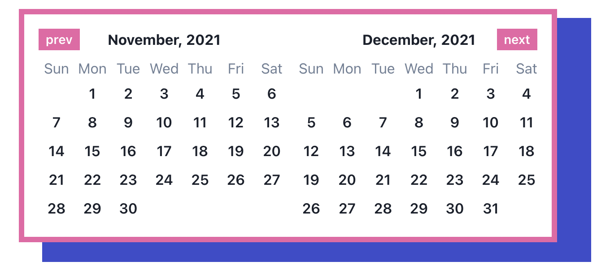

# Datepicker
<!-- ALL-CONTRIBUTORS-BADGE:START - Do not remove or modify this section -->
[](#contributors-)
<!-- ALL-CONTRIBUTORS-BADGE:END -->

A simple datepicker component build with [date-fns][1] and [Chakra-UI][2].

## Table of Contents

- [Requisites](#requisites)
- [Installation and Usage](#installation-and-usage)
- [Customizing](#customizing)
- [License](#license)

## Requisites
You need to install [date-fns][1] and [chakra-ui][2] in order to use this library.

```bash
yarn add date-fns
```

To install chakra-ui follow their [guide here](https://chakra-ui.com/guides/first-steps#framework-guide).

## Installation and Usage
After install these dependencies you can now install the library and use this as below:

```bash
yarn add @uselessdev/datepicker
```

Before to use this you can create your own theme or use the default one.

```tsx
import { ChakraProvider } from '@chakra-ui/react'
import {
  Calendar,
  CalendarDefaultTheme,
  CalendarControls,
  CalendarPrevButton,
  CalendarNextButton,
  CalendarMonths,
  CalendarMonth,
  CalendarMonthName,
  CalendarWeek,
  CalendarDays,
} from '@uselessdev/datepicker'

export function App() {
  const [dates, setDates] = useState()

  const handleSelectDate = (values) => setDates(values)

  return (
    return (
      <ChakraProvider theme={CalendarDefaultTheme}>
        <Calendar value={dates} onSelectDate={handleSelectDate}>
          <CalendarControls>
            <CalendarPrevButton />
            <CalendarNextButton />
          </CalendarControls>

          <CalendarMonths>
            <CalendarMonth>
              <CalendarMonthName />
              <CalendarWeek />
              <CalendarDays />
            </CalendarMonth>
          </CalendarMonths>
        </Calendar>
      </ChakraProvider>
    )
  )
}
```

**note that the example above doens't render an input but only the calendar**

If you want to use this with inputs and a popover [you can see this example](https://uselessdev-datepicker.netlify.app/?path=/story/calendar--with-input-popover-start-end-dates)

### Customizing
You can fully customize the Calendar component using the `extendTheme` provided by chakra-ui, you can see an example below.

In your theme you can overrides the default theme (you can see all available components keys for theme customization here)

```ts
import { extendTheme } from '@chakra-ui/react'
import { CalendarDefaultTheme } from '@uselessdev/datepicker'

export const theme = extendTheme(CalendarDefaultTheme, {
  components: {
    Calendar: {
      parts: ['calendar'],

      baseStyle: {
        calendar: {
          borderWidth: '6px',
          borderColor: 'pink.400',
          rounded: 'none',
          shadow: 'none',
          boxShadow: '32px 16px 0 6px #3B4DCC'
        },
      },
    },

    CalendarControl: {
      parts: ['button'],

      baseStyle: {
        button: {
          h: 6,
          px: 2,
          rounded: 'none',
          fontSize: 'sm',
          color: 'white',
          bgColor: 'pink.400',

          _hover: {
            bgColor: 'pink.200',
          },

          _focus: {
            outline: 'none',
          },
        },
      },
    }
  },
})
```

Now you can use this theme in `ChakraProvider`:

```tsx
import { ChakraProvider } from '@chakra-ui/react'
import { theme } from './theme'

function App() {
  return (
    <ChakraProvider theme={theme}>
      {/* children... */}
    </ChakraProvider>
  )
}
```

Theses changes will produce the following results in Calendar:



## Available components theme keys

| Key name        | Description                                                               | Parts                                    |
|-----------------|---------------------------------------------------------------------------|------------------------------------------|
| Calendar        | A multipart component this is reponsible for the calendar it self.        |`calendar`, `months`                      |
| CalendarMonth   | Responsible to style one month block.                                     |`month`, `name`, `week`, `weekday`, `days`|
| CalendarDay     | Applies styles to individual day. This is the only single part component. | --                                       |
| CalendarControl | Applies styles to prev and next months.                                   |`controls`, `button`                      |

## License
This code is under the [Apache-2.0](LICENSE) License

[1]: https://date-fns.org/
[2]: https://chakra-ui.com/

## Contributors ✨

Thanks goes to these wonderful people ([emoji key](https://allcontributors.org/docs/en/emoji-key)):

<!-- ALL-CONTRIBUTORS-LIST:START - Do not remove or modify this section -->
<!-- prettier-ignore-start -->
<!-- markdownlint-disable -->
<table>
  <tbody>
    <tr>
      <td align="center" valign="top" width="14.28%"><a href="https://iamwallace.dev"><br /><sub><b>Wallace Batista</b></sub></a><br /><a href="https://github.com/uselessdev/datepicker/commits?author=uselessdev" title="Code">💻</a> <a href="#ideas-uselessdev" title="Ideas, Planning, & Feedback">🤔</a></td>
      <td align="center" valign="top" width="14.28%"><a href="http://htttp://www.leonardoelias.me"><br /><sub><b>Leonardo Elias</b></sub></a><br /><a href="https://github.com/uselessdev/datepicker/commits?author=leonardoelias" title="Code">💻</a></td>
      <td align="center" valign="top" width="14.28%"><a href="https://github.com/kivi"><br /><sub><b>kivi</b></sub></a><br /><a href="https://github.com/uselessdev/datepicker/commits?author=kivi" title="Code">💻</a></td>
      <td align="center" valign="top" width="14.28%"><a href="http://guiteixeira.dev"><br /><sub><b>Guilherme Teixeira </b></sub></a><br /><a href="https://github.com/uselessdev/datepicker/commits?author=ggteixeira" title="Code">💻</a></td>
      <td align="center" valign="top" width="14.28%"><a href="https://github.com/branislaav"><br /><sub><b>Brano Zavracky</b></sub></a><br /><a href="https://github.com/uselessdev/datepicker/commits?author=branislaav" title="Code">💻</a></td>
      <td align="center" valign="top" width="14.28%"><a href="https://pixel.is-a.dev"><br /><sub><b>O. Qudah</b></sub></a><br /><a href="https://github.com/uselessdev/datepicker/commits?author=BasicPixel" title="Documentation">📖</a></td>
      <td align="center" valign="top" width="14.28%"><a href="https://medium.com/@tomchentw"><br /><sub><b>Tom Chen</b></sub></a><br /><a href="https://github.com/uselessdev/datepicker/commits?author=tomchentw" title="Documentation">📖</a> <a href="https://github.com/uselessdev/datepicker/commits?author=tomchentw" title="Code">💻</a></td>
    </tr>
    <tr>
      <td align="center" valign="top" width="14.28%"><a href="https://github.com/astahmer"><br /><sub><b>Alexandre Stahmer</b></sub></a><br /><a href="https://github.com/uselessdev/datepicker/commits?author=astahmer" title="Code">💻</a></td>
      <td align="center" valign="top" width="14.28%"><a href="https://github.com/raphaelrochap"><br /><sub><b>Raphael da Rocha Pinto Barboza</b></sub></a><br /><a href="https://github.com/uselessdev/datepicker/commits?author=raphaelrochap" title="Code">💻</a></td>
      <td align="center" valign="top" width="14.28%"><a href="https://gleu.ch"><br /><sub><b>Greg Leuch</b></sub></a><br /><a href="https://github.com/uselessdev/datepicker/commits?author=gleuch" title="Code">💻</a></td>
    </tr>
  </tbody>
</table>

<!-- markdownlint-restore -->
<!-- prettier-ignore-end -->

<!-- ALL-CONTRIBUTORS-LIST:END -->

This project follows the [all-contributors](https://github.com/all-contributors/all-contributors) specification. Contributions of any kind welcome!
